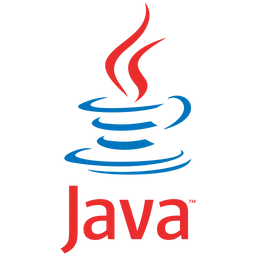
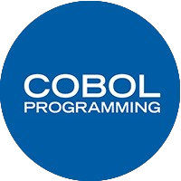
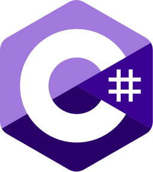
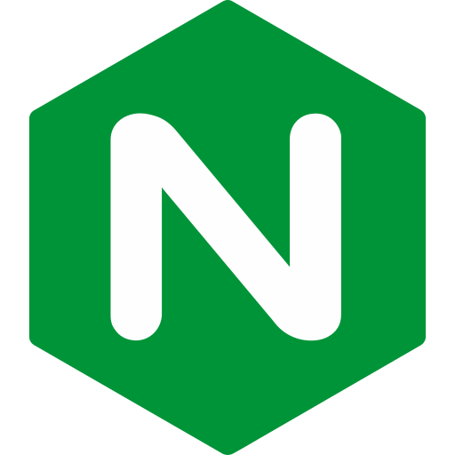
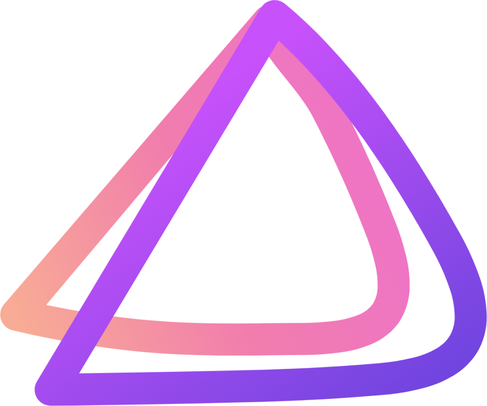
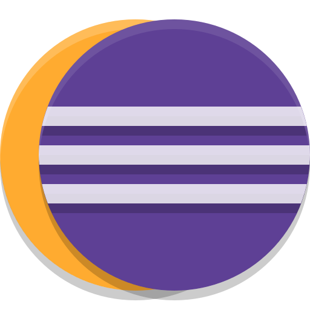
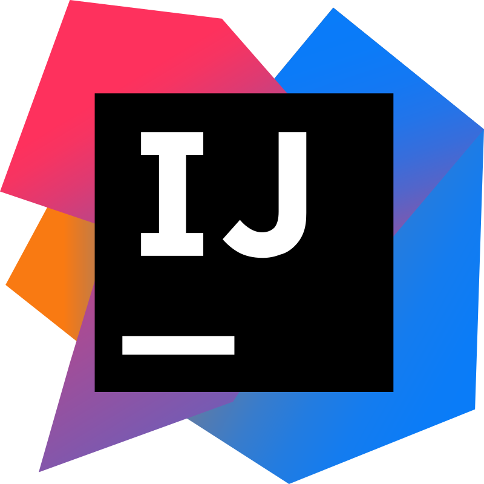
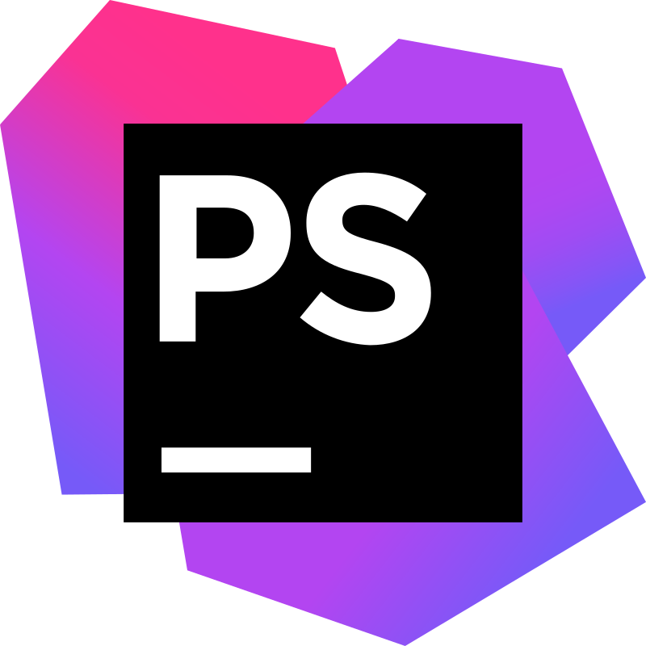

# 👋 Hello there! (Obi-Wan Kenobi voice)

I'm Victor!  
💻 I'm a **Backend Developer**  
📚 Currently a student at **IUT de Lens**, **FRANCE**

## 🚀 Languages and Technologies

### 💻 Application Development
  

### 🌐 Web Development
  
  
 

### 🗄️ Databases

### 🛠️ Scripting and Tools
  
  

## 🛠️ IDEs & Tools
  
  

## 📊 My GitHub Stats

 
 

### ✨ Check out my repositories / Portfolio for more!
