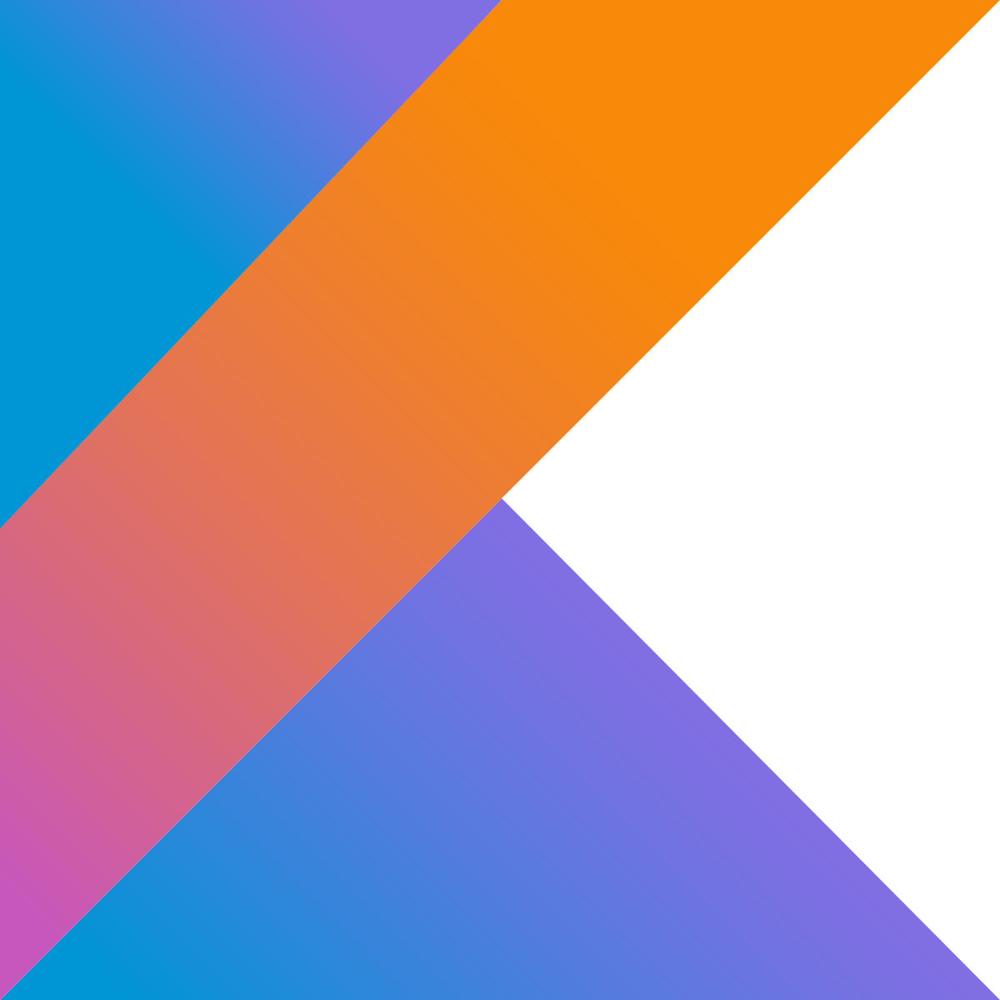
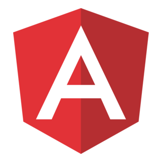
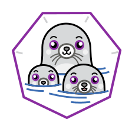
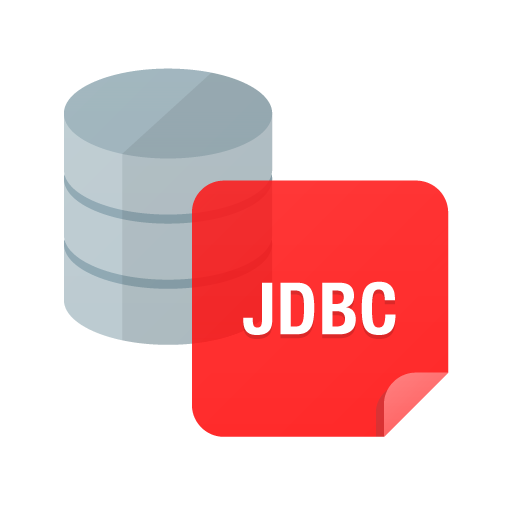
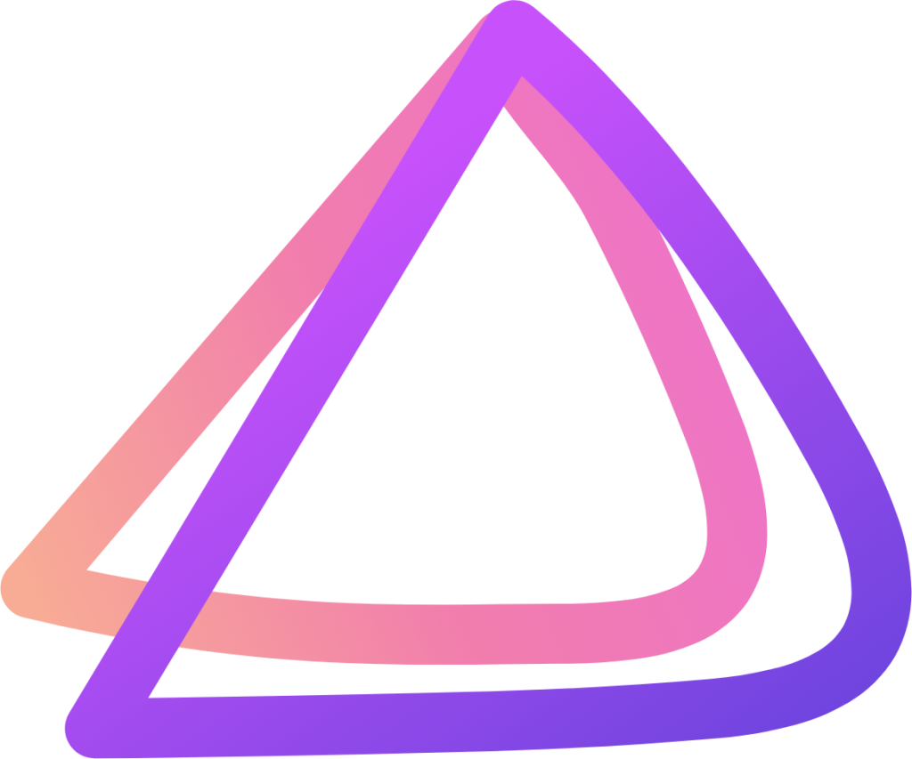
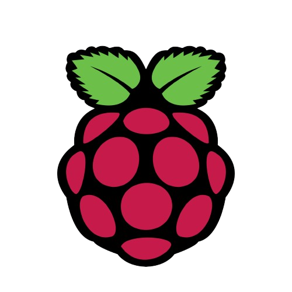
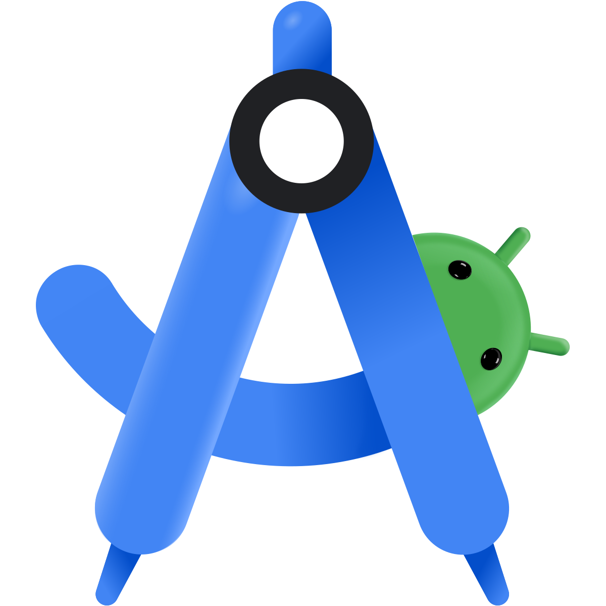
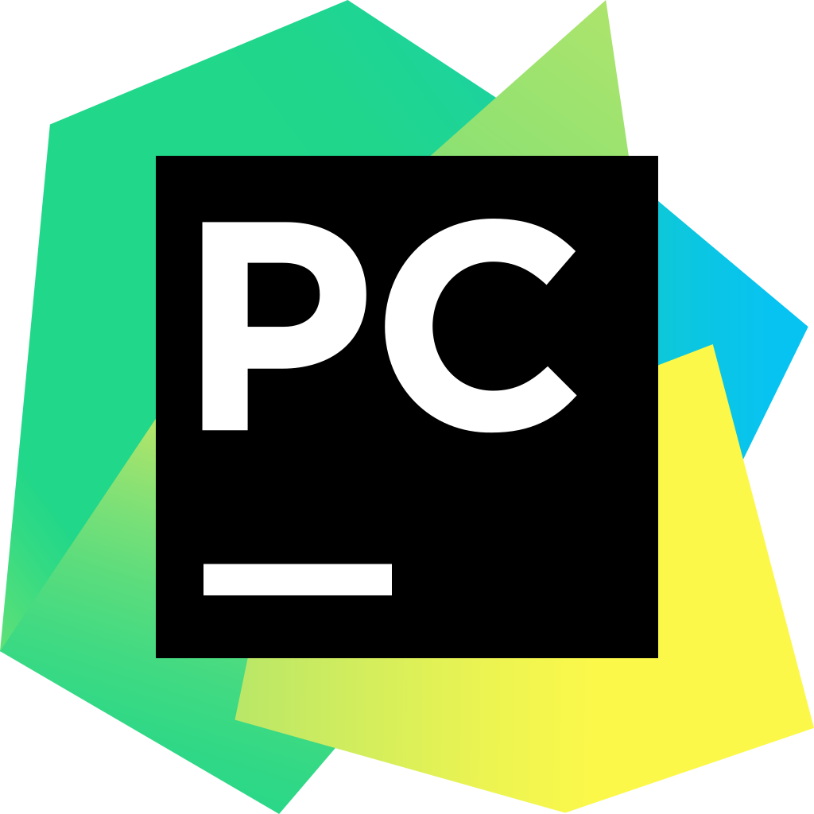
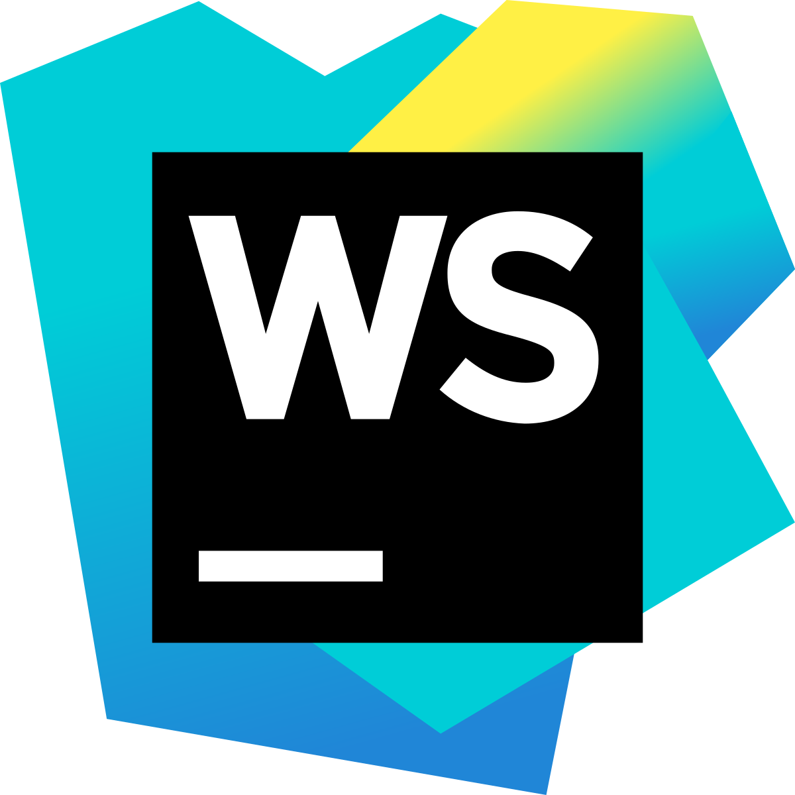

# 👋 Hello there! (Obi-Wan Kenobi voice)

I'm Victor!  
💻 I'm a **Junior Developer**  
📚 Currently a student at **IUT de Lens**, **FRANCE**, Year 3
Raspberry Pi & Libre Computer board Enjoyer
 

## 🚀 Languages & Technologies

### 💻 Application Development
  
  

### 🌐 Web Development
  
  
   

### 🖥️ Virtualisation | Deployment
  
  

### 🗄️ Databases

### 🛠️ Scripting & OS
  
  

## 🛠️ IDEs 
  
  

## 📊 My GitHub Stats

 
 

### ✨ Check out my repositories / Portfolio for more!

